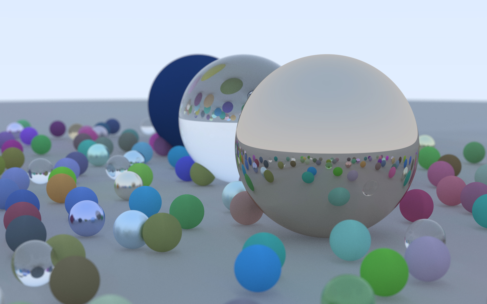

# Ray Tracing 101

RayTracing101 is a path-tracer, inspired by ["Ray Tracing in One Weekend"](https://raytracing.github.io/books/RayTracingInOneWeekend.html) series, with some improvements/optimisations/bugfixes.
IMHO, the book itself is great, but the code provided - not at all. 
So, I've decided to write my own implementation of the techniques described in this book, and from the point of view of self-education, this is much better.

